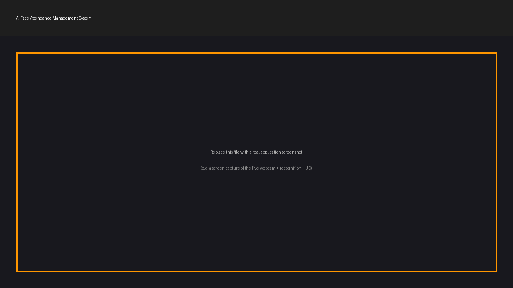

<div align="center">

# 🎓 AI Face Attendance Management System

### Real-time face recognition attendance tracking — register once, get recognized automatically, every time.


</div>

---

## 📌 Project Description

**AI Face Attendance Management System** is a real-time, computer-vision
based attendance solution that replaces manual roll calls and sign-in
sheets with automatic, face-recognition-driven attendance marking. Built
on top of `face_recognition` (a Python wrapper around dlib's state of the
art face recognition model), the system detects and identifies faces
live from a webcam feed, matches them against a registered student
database, and automatically logs attendance with name, date, and time —
while intelligently preventing duplicate entries for the same person on
the same day.

This project was built as a portfolio piece for an **AI & Machine
Learning diploma**, with an emphasis on clean architecture, modular
design, and production-style engineering practices — including a
resilient encoding cache, averaged multi-sample face embeddings, and
graceful handling of unknown faces — rather than a quick single-file
script.

> 💡 Register a student once with a handful of face samples. From then
> on, they simply walk in front of the camera and attendance is marked
> automatically.

---

## ✨ Features

| Feature | Description |
|---|---|
| 🖐️ **Real-time face recognition** | Live webcam face detection and identification powered by `face_recognition` (dlib) |
| 📝 **Register new users with face images** | Interactive, guided in-app registration flow — captures multiple face samples per student |
| ✅ **Automatic attendance marking** | Recognized students are marked present instantly, with no manual action required |
| 🗓️ **Name, Date & Time logging** | Every attendance record captures who, when (date), and what time |
| 🚫 **Duplicate attendance prevention** | Each student can only be marked present once per day, even across app restarts |
| ❓ **Unknown face detection** | Unrecognized faces are clearly flagged as "Unknown" and are never marked present |
| 📊 **CSV-based attendance storage** | Human-readable, spreadsheet-compatible attendance log |
| 🗂️ **Student image dataset management** | Organized, per-student image folders with automatic sanitized naming |
| 📈 **Live FPS counter** | On-screen, smoothed real-time frame rate |
| 🎯 **Detection confidence display** | Live match-confidence percentage shown per recognized face |
| 📷 **Webcam status indicator** | Visual ONLINE/OFFLINE indicator with automatic recovery on frame-read failure |
| 🎨 **Professional UI overlay** | Clean HUD panel with FPS, webcam status, face count, confidence, and attendance stats |
| ⌨️ **Safe exit shortcut** | Press `Q` or `ESC` to shut down cleanly at any time |
| 🛡️ **Robust error handling** | Graceful handling of missing cameras, dropped frames, and dataset/image errors |
| ⚡ **Optimized recognition performance** | Frame downscaling + throttled detection intervals keep the pipeline real-time despite dlib's CPU cost |

---

## 🛠️ Technology Stack

- **Python 3.12+**
- **[OpenCV](https://opencv.org/)** — webcam capture, image processing, on-screen UI rendering
- **[face_recognition](https://github.com/ageitgey/face_recognition)** — face detection and 128-dimension face encoding (built on dlib)
- **[NumPy](https://numpy.org/)** — encoding averaging and distance calculations
- **[Pandas](https://pandas.pydata.org/)** — attendance CSV structure creation and date-based record filtering
- **CSV (Python standard library)** — fast, per-event attendance row writing
- **[Pillow](https://python-pillow.org/)** — saving captured face images during registration

---

## ⚙️ Installation

### 1. Clone the repository

```bash
git clone https://github.com/abidcore/AI-Face-Attendance-System.git
cd AI-Face-Attendance-System
```

### 2. Create a virtual environment (recommended)

```bash
python -m venv venv

# Windows
venv\Scripts\activate

# macOS / Linux
source venv/bin/activate
```

### 3. Install dependencies

```bash
pip install -r requirements.txt
```

> ⚠️ **Important:** `face_recognition` depends on **dlib**, which is
> compiled from C++ source. Before installing, make sure you have:
> - **Windows:** [CMake](https://cmake.org/download/) and the "Desktop
>   development with C++" workload from Visual Studio Build Tools.
> - **macOS:** `brew install cmake`
> - **Linux:** `sudo apt install cmake build-essential`
>
> Once these are installed, `pip install -r requirements.txt` will build
> and install dlib automatically.

### 4. Run the application

```bash
python main.py
```

---

## 🎮 Usage

| Key | Action |
|---|---|
| *(default)* | Live attendance mode — recognized students are marked present automatically |
| `R` | Register a new student (guided, interactive capture flow) |
| `Q` / `ESC` | Exit the application safely |

**To register a new student:**
1. Press `R` while the application is running.
2. Enter the student's full name in the terminal when prompted.
3. Look directly at the camera — the system automatically captures
   several face samples once exactly one face is detected in frame.
4. Once capture completes, the recognition database is rebuilt
   automatically and the student can be recognized immediately.

All thresholds (recognition tolerance, image count, detection frequency,
etc.) can be tuned in **`config/settings.py`** without touching any
application logic.

---

## 📂 Folder Structure

```
AI-Face-Attendance-System/
│
├── main.py                    # Application entry point / main loop
├── requirements.txt           # Python dependencies
├── README.md                  # Project documentation (this file)
├── LICENSE                    # MIT License
├── .gitignore                 # Git ignore rules
│
├── assets/
│   ├── demo.png                # Screenshot placeholder
│   └── logo.png                # Project logo placeholder
│
├── config/
│   ├── __init__.py
│   └── settings.py             # Centralized, tunable configuration
│
├── src/
│   ├── __init__.py
│   ├── face_detector.py         # face_recognition-based detection wrapper
│   ├── face_recognition_system.py # Encoding database, caching & matching
│   ├── attendance_manager.py    # CSV attendance I/O & duplicate prevention
│   ├── dataset_manager.py       # Student image dataset file management
│   ├── utils.py                  # HUD & face-box drawing helpers
│   └── fps.py                    # FPS counter utility
│
├── database/
│   ├── attendance.csv           # Attendance log (Name, Date, Time, Status)
│   └── students/                 # Per-student registered face images
│       └── .gitkeep
│
└── docs/
    └── project_report.md       # Detailed technical project report
```

> 📁 **Note:** `database/students/*`, `database/encodings.pkl`, and
> `database/attendance.csv` are excluded from version control by default
> (see `.gitignore`) since they contain personal/generated data. They are
> created and populated automatically as you use the application.

---

## 🔄 Attendance Workflow

```
Webcam Frame
     │
     ▼
FaceDetector              ──►  Downscaled-frame face detection (dlib HOG)
     │
     ▼
FaceRecognitionSystem      ──►  128-d face encoding + comparison against
                                the averaged known-student encoding
                                database (cached on disk)
     │
     ▼
     ├── Known match  ──► AttendanceManager.mark_attendance()
     │                        ├── Not yet marked today → write CSV row
     │                        │    (Name, Date, Time, Status)
     │                        └── Already marked today → skip (no duplicate)
     │
     └── No match      ──► Labeled "Unknown" — no attendance action taken
```

---

## 🖼️ Screenshots

> Replace the placeholder image below with an actual screen capture of the
> application running (webcam feed + recognition boxes + HUD).

<div align="center">
  
</div>

---

## ✅ Advantages

- Fully automated attendance — no manual sign-in, no roll call
- Multi-sample averaged face encodings improve recognition robustness
  over single-reference-image approaches
- Encoding cache with automatic invalidation keeps startup fast without
  ever serving stale data
- Strong duplicate-attendance protection that persists correctly across
  application restarts
- Clear separation between "known" and "unknown" faces prevents
  incorrect attendance from being recorded
- Cleanly separated, independently testable modules

---

## 🚀 Future Scope

- 🧠 Add liveness detection (anti-spoofing) to prevent attendance being marked from a photo held up to the camera
- 🖥️ Build a companion admin dashboard (e.g. Streamlit) for browsing attendance history, exporting reports, and managing students without editing files directly
- ☁️ Migrate storage from CSV to a proper database (SQLite/PostgreSQL) for larger deployments
- 👥 Multi-face batch registration from an existing photo folder
- 📧 Automated daily/weekly attendance summary email reports
- 🧪 Automated unit tests and a CI pipeline via GitHub Actions
- 📦 Packaging as a standalone executable for non-technical administrators
- 🌐 Web-based version using a browser webcam feed for remote/classroom deployment

---

## 📄 License

This project is licensed under the **MIT License** — see the [LICENSE](LICENSE) file for details.

---

## 👤 Author

**Abid Ali**
AI & Machine Learning Diploma Student

- GitHub: [@abidcore](https://github.com/abidcore)
- LinkedIn: [Abid Ali Shaikh](https://www.linkedin.com/in/abid-ali-shaikh-03a591423)
- Email: abidalishaikh2007@gmail.com

---

<div align="center">

⭐ If you found this project useful, consider giving it a star on GitHub!

</div>
